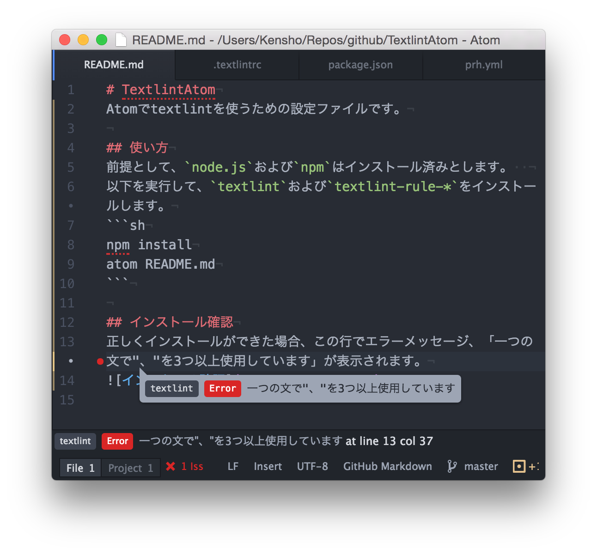

# TextlintAtom
[Atom](https://atom.io/)で[textlint](https://github.com/textlint/textlint)を使うためのインストール手順です。プラグインに[linter-textlint](https://github.com/1000ch/linter-textlint)を用います。

## インストール手順
#### 1. Node.jsおよびnpmのインストール
* Windowsの場合
    1. [chocolatey](https://chocolatey.org/)でNode.jsをインストールします。
    ```sh
    choco install nodejs.install
    ```
* Mac OS Xの場合  
    1.  [anyenvで開発環境を整える](http://qiita.com/luckypool/items/f1e756e9d3e9786ad9ea)にしたがってndenvをインストールします。
    2. 以下を実行し、Node.jsのバージョンをv5.0.0に変更します。
    ```sh
    ndenv install v5.0.0
    ndenv global v5.0.0
    ndenv rehash
    ```

#### 2. textlintおよびtextlint-rule-* のインストール  
[!] Windowsの場合はPowerShell、Mac OS Xの場合はBashで実行してください。
```sh
cd [本READMEがあるディレクトリ]
npm install -g textlint
npm install
```

#### 3. linter-textlintのインストール  
[!] Windowsの場合はPowerShell、Mac OS Xの場合はBashで実行してください。
```sh
apm install linter-textlint # Atom内からのpackage installでもOK
```

## インストール確認
1. atomで本READMEを開く  
[!] プロジェクトとして開く必要があるのでご注意ください。

    ```sh
    cd [本READMEがあるディレクトリ]
    atom .
    ```
2. エラー確認  
正しくインストールができた場合、下画像のように、エラーメッセージ「一つの文で"、"を3つ以上使用しています」が表示されます。

